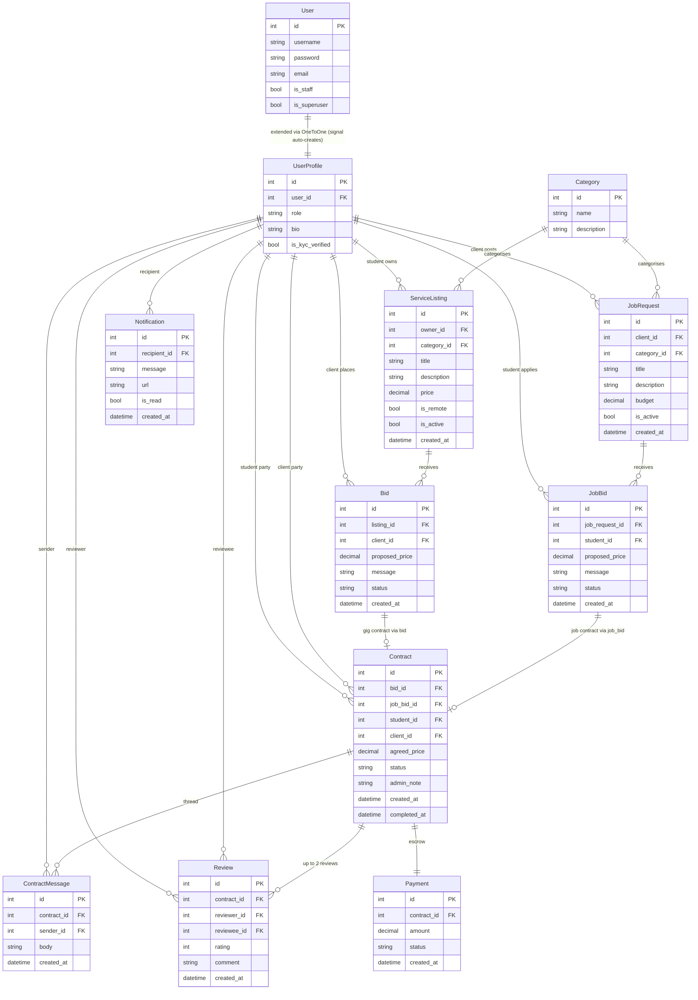

# StudentGig

A student freelance marketplace where students offer services and clients hire them. Built with Django 6 as a university project.

Youtube video link: https://youtu.be/8MF9EErnbNw

---

## Quick Start (Any Platform)

### Prerequisites — install `uv` once

| Platform | Command |
|---|---|
| Linux / macOS | `curl -LsSf https://astral.sh/uv/install.sh \| sh` |
| Windows (PowerShell) | `powershell -c "irm https://astral.sh/uv/install.ps1 \| iex"` |
| Any (pip) | `pip install uv` |

`uv` handles Python version management automatically — you do **not** need to install Python 3.13 separately.

### Start the server

```bash
# Clone the repo
git clone https://github.com/zanish-bi/ele3921.git
cd ele3921
```

After cloning, open the project folder and navigate into it, then run the launcher for your platform:

```bash
# Linux / macOS
./start.sh

# Windows (Command Prompt)
start.bat

# Windows (PowerShell)
.\start.ps1
```

On first run the script will:
1. Apply all database migrations (creates `db.sqlite3`)
2. Seed the database with test users, listings, contracts, and reviews
3. Start the development server at **http://127.0.0.1:8000**

### Manual setup (pip fallback — no uv)

```bash
pip install -r requirements.txt
python manage.py migrate
python manage.py seed
python manage.py runserver
```

---

## Test Accounts

After running the start script or `python manage.py seed`:

| Username | Password | Role | KYC |
|---|---|---|---|
| `student1` | `pass1234` | Student | Verified — has active listings and contracts |
| `student2` | `pass1234` | Student | **Pending** — demo the KYC test-mode button |
| `client1` | `pass1234` | Client | Verified — has bids, contracts, and a job request |
| `admin` | `admin` | Superuser | Django admin at `/admin/` |

### KYC Test Mode

Real KYC is set by an admin in the Django admin panel. For testing, every unverified user sees a **"Simulate KYC Verification (Test Mode)"** button on their dashboard and home page — one click and they can post listings or place bids immediately.

---

## Key URLs

### Service Listings (Gigs — student posts, client bids)

| URL | What it does |
|---|---|
| `/listings/` | Browse all active service listings |
| `/listings/create/` | Post a new service (student, KYC required) |
| `/listings/<pk>/` | Listing detail + bid management for owner |
| `/listings/<pk>/bid/` | Place a bid (client, KYC required) |
| `/listings/<pk>/edit/` | Edit listing (owner only) |
| `/bids/<pk>/accept/` | Accept a bid (listing owner) |
| `/bids/<pk>/reject/` | Reject a bid (listing owner) |
| `/bids/<pk>/edit/` | Edit a pending bid (bid owner) |
| `/bids/<pk>/delete/` | Withdraw a pending bid (bid owner) |

### Job Requests (client posts, student bids)

| URL | What it does |
|---|---|
| `/jobs/` | Browse all open job requests |
| `/jobs/create/` | Post a job request (client, KYC required) |
| `/jobs/<pk>/` | Job detail + bids for owner |
| `/jobs/<pk>/bid/` | Apply/bid on a job (student, KYC required) |
| `/job-bids/<pk>/accept/` | Accept a job bid (job owner / client) |
| `/job-bids/<pk>/reject/` | Reject a job bid (job owner / client) |

### Contracts

| URL | What it does |
|---|---|
| `/contracts/` | All your contracts (active + completed) |
| `/contracts/<pk>/` | Contract detail with message thread |
| `/contracts/<pk>/complete/` | Submit work (student on active contract) |
| `/contracts/<pk>/accept/` | Accept delivery, release payment (client) |
| `/contracts/<pk>/reject/` | Raise a dispute (client on delivered contract) |
| `/contracts/<pk>/review/` | Leave a review (completed contracts only) |
| `/contracts/<pk>/message/` | Post a message in the contract thread |

### Other

| URL | What it does |
|---|---|
| `/` | Home / landing page |
| `/profiles/<user_pk>/` | Public user profile with listings and reviews |
| `/dashboard/` | Your personalised dashboard |
| `/notifications/` | Your notification inbox |
| `/notifications/mark-read/` | Mark all notifications as read |
| `/accounts/register/` | Register as student or client |
| `/accounts/login/` | Login |
| `/admin/` | Django admin panel (admin/admin) |

---

## Workflows

### WF-1 — Gig Lifecycle (student posts service)

```
Student registers → KYC verify → Post a Service listing
Client registers → KYC verify → Browse listings → Place a Bid
Student accepts bid → Contract created (payment held in escrow)
Student submits work → Contract status: delivered
Client reviews delivery:
  ├── Accept → payment released → status: completed → both leave reviews
  └── Reject → status: disputed → admin resolves via /admin/
```

### WF-2 — Gig Dispute Resolution

```
Client rejects delivery → contract: disputed, payment: held
Admin logs into /admin/ → Contracts → selects contract
  ├── Action "Release payment" → contract: completed, payment: released
  └── Action "Refund payment" → contract: disputed, payment: refunded
Admin optionally sets admin_note → visible to both parties on contract detail
```

### WF-3 — Job Request Lifecycle (client posts job)

```
Client registers → KYC verify → Post a Job Request (with budget)
Student browses /jobs/ → Opens job detail → Apply / Bid
Client reviews bids on job detail → Accept a bid
Contract created → same delivery/dispute flow as WF-1
```

### WF-4 — Bid Management

```
Client places a pending bid → can Edit or Withdraw while pending
Student sees all bids on their listing dashboard section
Student can Accept (creates contract) or Reject individual bids
Accepting one bid auto-rejects all other pending bids on the same listing
```

### WF-5 — KYC Gate

```
New user registers → KYC: Pending
Unverified users can browse but cannot: post listings, post jobs, place bids
Admin toggles KYC via Django admin (bulk action on UserProfile)
Test mode: dashboard shows "Simulate KYC Verification" button for quick demo
```

### WF-6 — Notifications

```
Key events auto-create a Notification for the other party:
  - New bid placed → listing owner notified
  - Bid accepted / rejected → bidder notified
  - Work submitted → client notified
  - Delivery accepted / disputed → student notified
  - New contract message → other party notified

Bell icon in navbar shows unread count
/notifications/ page lists all; "Mark all read" clears count
```

### WF-7 — Contract Messaging

```
Both parties can send messages on any contract
Messages appear in chronological thread on contract detail page
Each message notifies the other party
Outsiders (non-contract parties) are blocked (403)
```

### WF-8 — Public Profiles & Reviews

```
Any user (including anonymous) can view a public profile at /profiles/<pk>/
Profile shows: username, role, KYC badge, bio
Students: also shows active service listings
Both roles: shows reviews received with star ratings
Reviews are only submittable on completed contracts, once per reviewer per contract
```

---

## Capabilities

| Capability | Who |
|---|---|
| Post service listings (gigs) | Students (KYC verified) |
| Bid on service listings | Clients (KYC verified) |
| Post job requests | Clients (KYC verified) |
| Bid on job requests | Students (KYC verified) |
| Accept / reject bids | Listing owner (service) or job owner (job request) |
| Submit work | Student on active contract |
| Accept / dispute delivery | Client on delivered contract |
| Leave a review | Either party on a completed contract |
| Resolve disputes | Admin only (via Django admin) |
| Toggle KYC | Admin only (bulk action) or self-verify test button |
| Browse listings/jobs | Anyone (public) |
| View profiles | Anyone (public) |
| Message a contract | Contract parties only |

---

## Role Restrictions

| Action | Student | Client | Admin |
|---|---|---|---|
| Post service listing | ✅ (KYC) | ✗ | — |
| Post job request | ✗ | ✅ (KYC) | — |
| Bid on service listing | ✗ | ✅ (KYC) | — |
| Bid on job request | ✅ (KYC) | ✗ | — |
| Accept/reject service bids | ✅ (owner) | ✗ | — |
| Accept/reject job bids | ✗ | ✅ (owner) | — |
| Submit work | ✅ (student on contract) | ✗ | — |
| Accept/reject delivery | ✗ | ✅ (client on contract) | — |
| Release/refund payment | ✗ | ✗ | ✅ |
| Toggle KYC status | ✗ | ✗ | ✅ |

---

## Simplifications & Out of Scope

| Item | Decision |
|---|---|
| Real payment processing | Simulated escrow — `Payment.status` field only |
| Email notifications | In-app notifications only (no SMTP) |
| Real-time messaging | Page-refresh thread only (no WebSockets) |
| Document upload for KYC | Admin toggle + test-mode button only |
| Rating-based filtering | Not implemented (browse by price/category/remote only) |
| Mobile-first responsive | Basic responsive layout only |
| Password reset | Not implemented |
| OAuth / social login | Not implemented |
| File attachment for work delivery | Status toggle only — no file upload |

---

## Data Model Overview

How Django's built-in `User` and `auth` models are extended:



### Key Design Notes

- **`User` (built-in)** — Django's auth user; only used for authentication (`username`, `password`, `is_staff`, `is_superuser`).
- **`UserProfile`** — extends `User` via a `OneToOne` field. Created automatically by a `post_save` signal on every new `User`. Adds `role` (`student`/`client`), `bio`, and `is_kyc_verified`.
- **`Contract.bid` and `Contract.job_bid`** — both are nullable `OneToOneField`. Exactly one is set: gig contracts link via `bid`, job contracts link via `job_bid`. The `listing_title` and `bid_message` properties on `Contract` abstract this difference for templates.
- **`Payment.save()` override** — when `Payment.status` is changed to `released` or `refunded`, it automatically syncs the parent contract's status. This powers the admin dispute resolution flow.
- **`ContractAdmin.save_model()`** — when an admin directly changes `contract.status`, it syncs the payment record to match.

---

## Running Tests

```bash
uv run pytest core/tests.py -v --tb=short
```

284 tests covering models, admin actions, forms, views, role guards, and 13 end-to-end workflow scenarios.

---

## Project Structure

```
studentgig/
├── core/
│   ├── models.py          # 11 models (User extended + 10 custom)
│   ├── views.py           # All views with role/KYC guards
│   ├── forms.py           # BidForm, JobBidForm, JobRequestForm, ReviewForm, ContractMessageForm, ...
│   ├── urls.py            # All URL patterns
│   ├── admin.py           # KYC toggle + payment release/refund bulk actions
│   ├── signals.py         # UserProfile auto-creation on User save
│   ├── context_processors.py  # Unread notification count for navbar bell
│   ├── tests.py           # 284 tests
│   ├── templates/
│   │   ├── core/          # base.html + 15 page templates
│   │   └── registration/  # login.html, register.html
│   └── management/
│       └── commands/
│           └── seed.py    # Test data seed command
├── studentgig/
│   ├── settings.py
│   └── urls.py
├── requirements.txt
├── pyproject.toml
├── start.sh               # Linux/macOS launcher
├── start.bat              # Windows CMD launcher
└── start.ps1              # Windows PowerShell / cross-platform launcher
```

---

## Team

| Member | Responsibility | Status |
|---|---|---|
| Zanish | Backend + Frontend — models, views, admin, migrations, templates, tests | Complete |
| Danjal | Testing, debugging, QA, permissions testing, user workflow validation, GitHub coordination, documentation, video recording/editing, and project feedback | Complete |

See `BACKEND_README.md` for the full backend reference.
